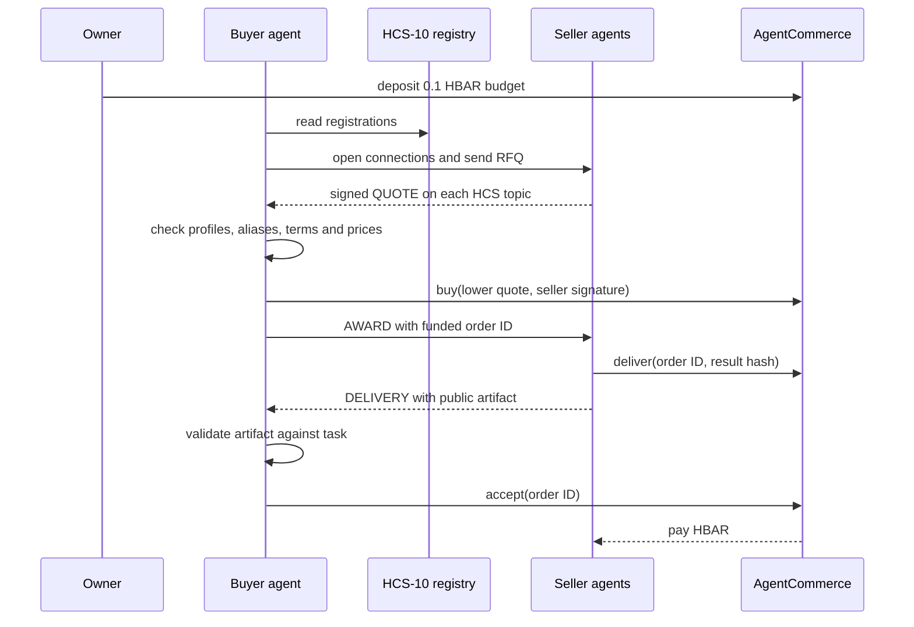
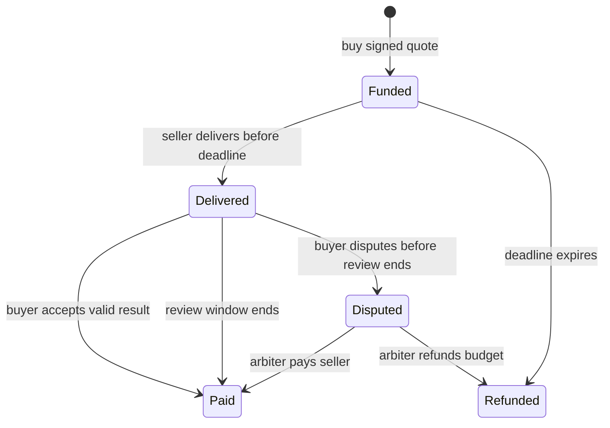

# How agent commerce works

The template composes **HCS-10 communication** with a **Hedera smart contract escrow**. The buyer and sellers have different ECDSA accounts. One CLI process drives the reproducible demo, but the parties exchange requests and replies through actual Hedera topics and settle through actual contract transactions. For exact wire fields and settlement conditions, see the [protocol specification](TECHSPEC.md).

## Components and evidence

| Component                        | Job                                                                                      | Public evidence                                           |
| -------------------------------- | ---------------------------------------------------------------------------------------- | --------------------------------------------------------- |
| HCS-11 profiles on HCS-1         | Advertise each agent's `commerce.stats.v1` capability, account alias, and HCS-10 topics. | Agent account memo points at a profile topic.             |
| Owner-controlled HCS-10 registry | Lists the buyer and two sellers for this demo.                                           | `register` messages on a registry topic.                  |
| HCS-10 connection topics         | Carry application RFQ, quote, award, and delivery messages.                              | Topic ID and sequence number in the public receipt.       |
| `AgentCommerce.sol`              | Enforces signed terms, spending caps, escrow states, refunds, and payouts.               | Contract order, events, and mirror-node contract results. |
| `/verify`                        | Reconstructs the documented trade from public HCS and EVM data.                          | Individual pass/fail checks in the browser.               |

The registry is created by this template, so discovery is limited to agents registered there. It is not a claim that the buyer searched every seller on Hedera. Setup publishes profiles directly to HCS-1 topics without a hosted inscription account. The pinned HCS SDK currently retrieves those public profiles through KiloScribe's CDN; the profile bytes themselves are on Hedera.

## Purchase sequence



In the included example, seller A quotes **0.05 HBAR**, seller B quotes **0.03 HBAR**, and the buyer chooses B. The task is a small statistics calculation with an objective validator. The commerce flow is the reusable part; the calculation is intentionally replaceable.

## Message boundary

HCS-10 defines the registry, connection, and outer `message` operation. The following `data` payloads are **this template's application protocol**, declared in [`packages/shared/src/index.ts`](../packages/shared/src/index.ts). They are not standard HCS-10 operations.

| Kind       | Key fields                              | Purpose                                          |
| ---------- | --------------------------------------- | ------------------------------------------------ |
| `RFQ`      | `task`, `buyer`, `maxPrice`, `replyBy`  | Ask for a service quote before the deadline.     |
| `QUOTE`    | `quote`, `signature`, `sellerAccountId` | Offer signed commercial terms.                   |
| `AWARD`    | `quoteDigest`, `orderId`                | Tell the selected seller which order was funded. |
| `DELIVERY` | `orderId`, `artifact`, `resultHash`     | Deliver the public demo result and its digest.   |

Every payload includes `protocol: "agent-commerce/1"`. The shared Zod schemas reject malformed message shapes. The task and artifact have canonical JSON encodings before hashing, so clients can recompute their digests. HCS messages are public: this demo posts no private input or secret output.

### Signed quote and on-chain enforcement

The seller signs EIP-712 `Quote` terms with its EVM key. The domain is `AgentCommerce` version `1`, Hedera testnet chain ID `296`, and the deployed contract address. The signed struct contains:

| Field              | Meaning                                                        |
| ------------------ | -------------------------------------------------------------- |
| `buyer`            | The contract address allowed to consume this quote.            |
| `seller`           | The seller's EVM address, matched to its Hedera account alias. |
| `taskHash`         | Digest of the requested job.                                   |
| `conversationHash` | Digest of the HCS-10 connection topic ID.                      |
| `price`            | Exact amount in tinybar.                                       |
| `deadline`         | Quote expiry and delivery deadline, as Unix seconds.           |
| `nonce`            | Unique value preventing quote reuse.                           |

Only the authorized buyer agent can call `buy`. The contract verifies the signature, exact terms, expiry, nonce, available prepaid balance, per-order cap, and total allowance. A successful purchase stores the quote digest, task hash, conversation hash, seller, and price. Seller-only `deliver` commits the result hash; buyer-only `accept` releases payment. See [`AgentCommerce.sol`](../packages/hardhat/contracts/AgentCommerce.sol) and its [tests](../packages/hardhat/test/AgentCommerce.test.ts).

### What the contract cannot see

Solidity cannot read HCS topic history. The contract verifies the signed hashes and commercial terms, while the buyer and the independent verifier fetch the HCS messages and check that those same terms appeared in the referenced conversation. The HCS `operator_id` field by itself is not a cryptographic proof of message authorship: both connection participants can submit to their shared topic. The seller's EIP-712 quote signature and seller-only on-chain delivery call provide stronger identity checks. The verifier checks only the two offers recorded in this demo's receipt; it cannot prove a global best price.

## HBAR units

On Hedera, the Solidity contract's `msg.value`, quote prices, caps, and balances are in **tinybar (8 decimals)**. Ethers sends the outer Ethereum transaction `value` in **weibar (18 decimals)**. Thus 0.03 HBAR is `3,000,000` tinybar in the quote, while an ethers transaction sending 0.03 HBAR uses `parseEther("0.03")`. The runner converts at that boundary; mixing the units causes `BudgetExceeded`. See the [Hedera unit documentation](https://docs.hedera.com/hedera/sdks-and-apis/sdks/smart-contracts/ethereum-transaction).

## Escrow states and recovery



The review window is one day after delivery. Anyone can call `refundExpired` for an undelivered order after its deadline or `finalizeAfterReview` for a delivered order after review. `npm run agents:recover` scans the deployed contract and calls those public recovery functions. A disputed order needs a trusted arbiter decision; a digest establishes which bytes were delivered, not whether arbitrary work is good.

## Public verifier

Local dashboards read a sanitized `.local/last-trade.json` receipt. The [hosted Vercel dashboard](https://hedera-agent-commerce.vercel.app/) instead uses the bundled public-only `packages/nextjs/data/public-trade.json` from the completed example trade. Its interactive office scene replays six stages with receipt-backed evidence links; it does not stream agent activity. The `/verify` route uses the selected receipt as a list of topic and transaction references, then checks the referenced HCS messages, Hedera account aliases, signed offers, selected price, task and result hashes, contract order, state, and transaction success against public nodes. Neither receipt contains keys. Its checks are intentionally separate so a developer can see which boundary failed. See [`packages/nextjs/lib/trade.ts`](../packages/nextjs/lib/trade.ts) for the exact assertions and the [README evidence table](../README.md#submission-evidence) for a completed testnet run.

## Walk through the included testnet order

1. Compare seller A's [0.05 HBAR quote](https://testnet.mirrornode.hedera.com/api/v1/topics/0.0.10834803/messages/2) with seller B's [0.03 HBAR quote](https://testnet.mirrornode.hedera.com/api/v1/topics/0.0.10834806/messages/2). Mirror-node HCS messages encode the outer JSON in base64. To read B's message:

   ```bash
   node -e 'fetch("https://testnet.mirrornode.hedera.com/api/v1/topics/0.0.10834806/messages/2").then(r => r.json()).then(x => console.log(JSON.stringify(JSON.parse(Buffer.from(x.message, "base64").toString()), null, 2)))'
   ```

   Its `data` contains a `QUOTE` whose price is `3000000` tinybar (0.03 HBAR), seller account is `0.0.10834728`, and signed terms include task and conversation hashes.

2. Open the [purchase contract result](https://testnet.mirrornode.hedera.com/api/v1/contracts/results/0xe841d46c6b42779cbb7688498c3428ad72131ef58b08b39007ffd01b6ed68732). The contract accepted B's signed terms and funded order 1.
3. Inspect the seller's [HCS delivery](https://testnet.mirrornode.hedera.com/api/v1/topics/0.0.10834806/messages/4) and its [on-chain digest commitment](https://testnet.mirrornode.hedera.com/api/v1/contracts/results/0x45a3cca09d431cac42d9da7427ec09bb199e5fbf479980c70fbe2d39029eeecb), then the [successful payout result](https://testnet.mirrornode.hedera.com/api/v1/contracts/results/0x84f6489fa3c462b5b841cd4445d71f5d0bb22157b73a7cd8ee9acc99518d3c75). The verifier automates these comparisons after your local demo writes a receipt.
